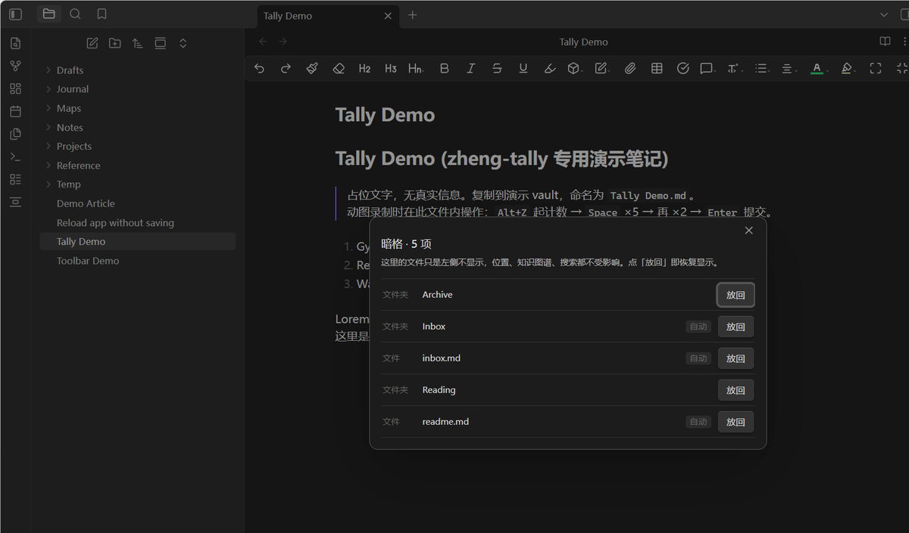
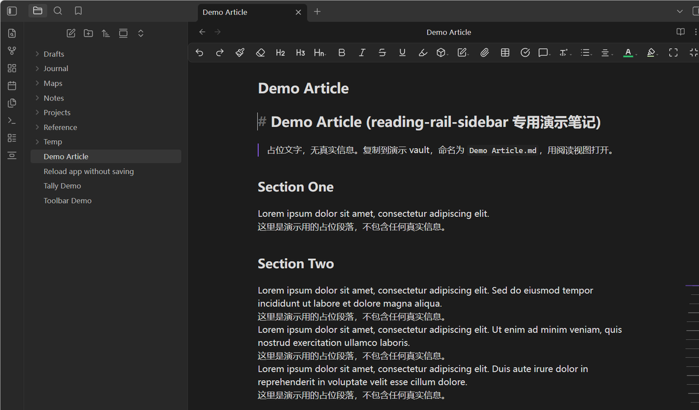
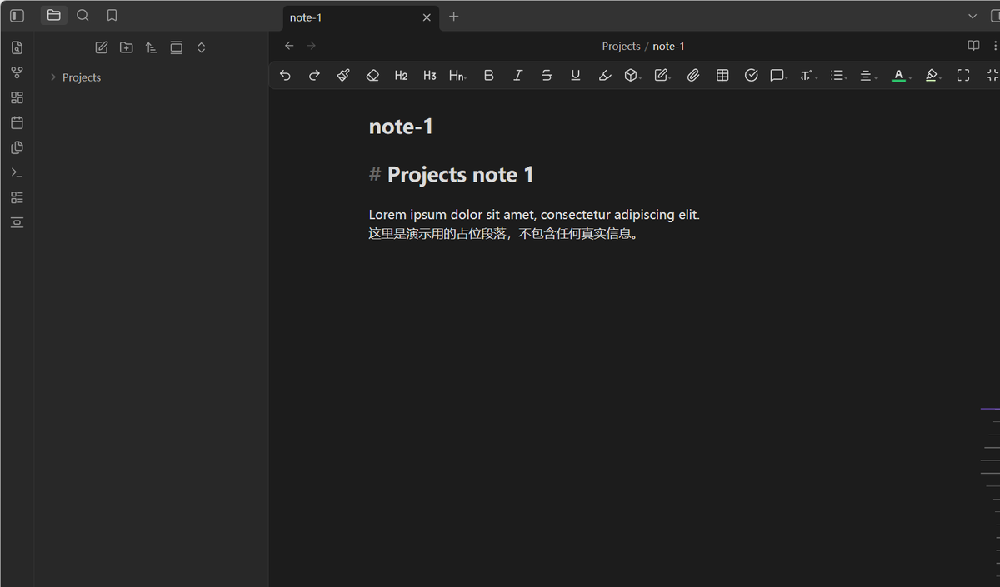

# Quiet Shelf

> Tuck archived notes out of the file explorer — without moving a single file.
> Then focus on just the folders you're working in.

Quiet Shelf does two things, both purely at the display layer of the file
explorer. Your files never move, nothing is renamed, and the graph, search,
backlinks and sync all keep working exactly as before.

## Hide

Shelve a file or folder and it simply stops showing up in the explorer. Shelved
items can be put back by hand at any time, and readme/inbox files can be
auto-shelved by filename.

Items you have manually un-shelved stay un-shelved — the automatic rule will not
grab them again.

### Auto-shelve rules

One rule per line, matched case-insensitively against the file name (without the
`.md` extension). `*` is a wildcard, and where you put it decides the match:

| Rule | Matches | Example |
|---|---|---|
| `index` | the name is exactly `index` | `index.md` |
| `*index` | the name ends with `index` | `_Aesthetic Index.md` |
| `index*` | the name starts with `index` | `index-old.md` |
| `*index*` | the name contains `index` anywhere | `my-index-old.md` |

Without a `*` the behaviour is the old exact match, so existing rules keep
working.

> **A bare rule is an exact match, not a substring match.** A rule of `hub`
> matches only a file called `hub` — it does **not** catch `github.md`,
> `GitHub.md` or `my-github.md`. To match everything containing a word, write
> `*word*`; but be aware that `github` **ends with** `hub`, so **`*hub` and
> `*hub*` both catch it**. `hub*` and a bare `hub` do not. Pick the position
> that says what you mean.

## Focus

Select folders and files across different levels of the tree, and only that set
(plus its ancestors and descendants) stays visible. Focus sets can be saved
under a name and recalled later.

## Why

The file explorer is a browse surface, not an archive. Once a vault grows past a
few hundred notes, the folders you finished months ago take up as much room as
the ones you use daily. Quiet Shelf lets the tree show the working set without
you having to reorganize the vault to get there.

## How it works

Everything is done with DOM-level class toggling on the explorer's own tree
items. The plugin reads `data-path` from each item's row and hides the
corresponding subtree; it does not use `fileItems`, `setCollapsed`, or any other
internal API, so it stays compatible across Obsidian updates.

## Usage

Open the shelf panel from the ribbon icon, or run a command from the palette:

| Command | What it does |
|---|---|
| Open shelf panel | Open the management panel |
| Batch manage | Shelve or restore several items at once |
| Toggle shelve | Shelve / restore the item under the cursor |
| Toggle focus | Turn focus mode on or off |
| Focus active folder | Focus the folder of the current note |
| Clear focus | Drop the current focus set |
| Save focus set | Save the current focus set under a name |

## Installation

**Community plugins:** search for "Quiet Shelf" in Settings → Community plugins.

**Manual:**

1. Download `main.js`, `manifest.json` and `styles.css` from the
   [latest release](https://github.com/yunmin311/quiet-shelf-obsidian/releases).
2. Put them in `<vault>/.obsidian/plugins/quiet-shelf/`.
3. Enable the plugin under Settings → Community plugins.

**Beta builds:** add `yunmin311/quiet-shelf-obsidian` to
[BRAT](https://github.com/TfTHacker/obsidian42-brat).

## Language

The settings page, commands, context-menu items, both modals and every notice
are available in **Chinese and English**. Pick a language at the top of the
settings page: `Auto` follows Obsidian's own language, or pin it to
`简体中文` / `English` explicitly.

Adding another language is a pure data change — an extra entry in
`locales.js` — with no build step involved.

## Privacy

No network access. No telemetry. No accounts. The plugin reads only the file
tree of the vault it runs in, and does not touch anything outside it.

Settings live in `data.json` inside the plugin folder, which is the same
mechanism every Obsidian plugin uses for local settings.

## License

[MIT](LICENSE)

---

## 中文说明

**暗格**：把归档、索引类的文件从左侧文件树里收起来。**文件本身不动** ——
物理位置、知识图谱、搜索、双链、同步全部照旧，只是不在树里显示了。
手动放回过的东西不会被自动规则再次收起。

**聚焦**：跨层级多选文件夹和文件，只留下选中组及其祖先与后代，可存成命名组合随时切换。

**自动规则（0.3.0 起支持通配符）**：`index` 精确匹配 / `index*` 开头 / `*index` 结尾 /
`*index*` 包含，均不分大小写。

⚠️ **不带 `*` 是精确匹配，不是包含匹配。** 规则写 `hub` **只**匹配名叫 `hub` 的文件，
**不会**收掉 `github.md` / `GitHub.md` / `my-github.md`。
想匹配"含某词"请写 `*词*` —— 但注意 **`github` 是「以 `hub` 结尾」的**
（g-i-t-h-u-b），所以 **`*hub` 和 `*hub*` 都会连带收掉 `github`**，
而 `hub*` 与裸 `hub` 不会。按你想说的那个位置来选。

安装：在社区插件里搜 "Quiet Shelf"，或从 Release 下载三个文件放进
`.obsidian/plugins/quiet-shelf/`。
